# Welcome to Interstellar Hand Duel!

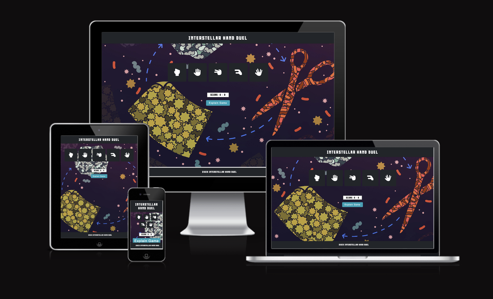

Prepare for an out-of-this-world experience as you face off against the computer in our extended version of the classic Rock, Paper, Scissors game. Welcome to Interstellar Hand Duel, where the cosmic elements of Rock, Paper, Scissors, Lizard, and Spock collide in an epic battle. Take on the computer in this thrilling hand-to-hand cosmic combat across the vastness of space!

## How to Play

- You can choose from five options: Rock, Paper, Scissors, Lizard, or Spock.
- The computer will randomly make its choice.
- The winner of each round is determined by the rules:
  - Rock crushes Scissors
  - Scissors cuts Paper
  - Paper covers Rock
  - Rock crushes Lizard
  - Lizard poisons Spock
  - Spock smashes Scissors
  - Scissors decapitates Lizard
  - Lizard eats Paper
  - Paper disproves Spock
  - Spock vaporizes Rock
- The game is played in rounds, and the first to win three rounds is the overall winner.

## Features

- **Player vs. Computer:**
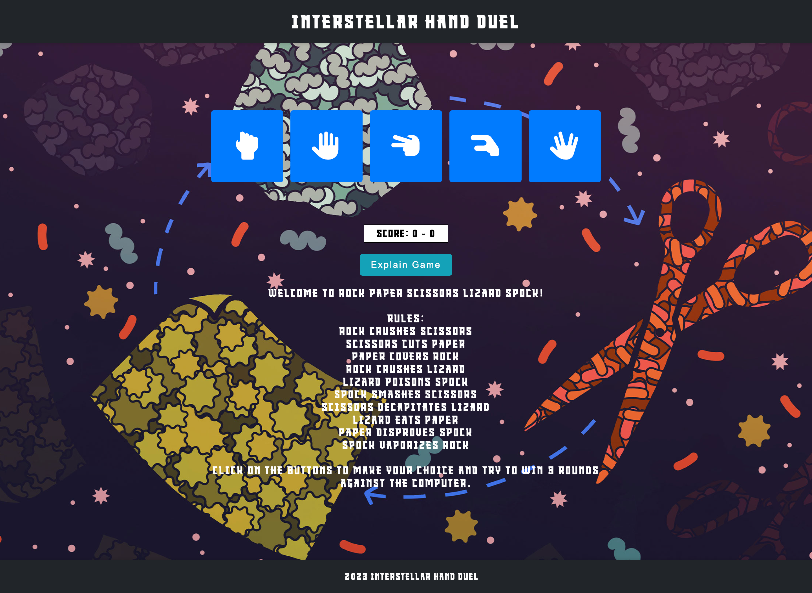
  - Enjoy by playing against the computer, testing your skills against an AI opponent.
- **Pattern Matching Functionality:**
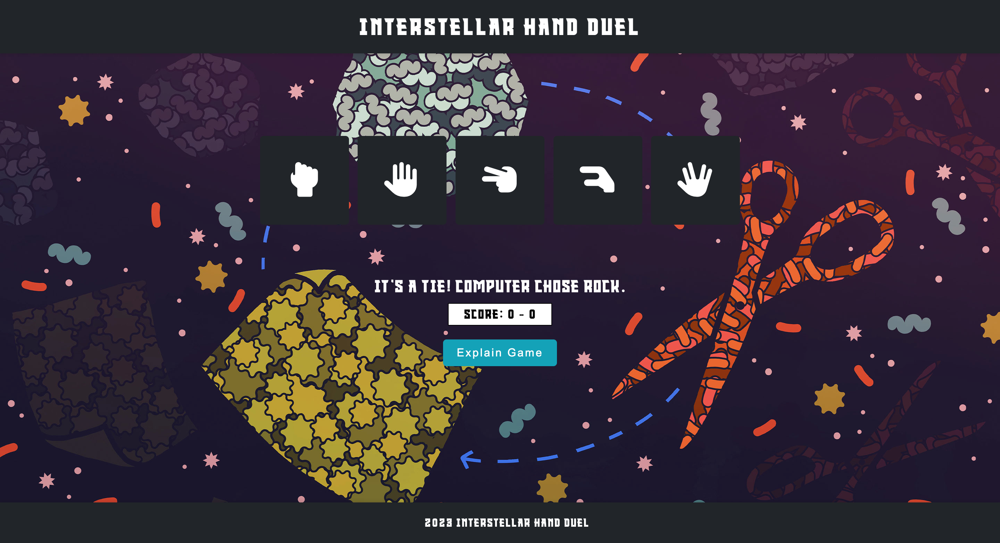
  - Engage in strategic gameplay with the ability to recognize and predict patterns in the opponent's moves.
- **Limited Tries:**
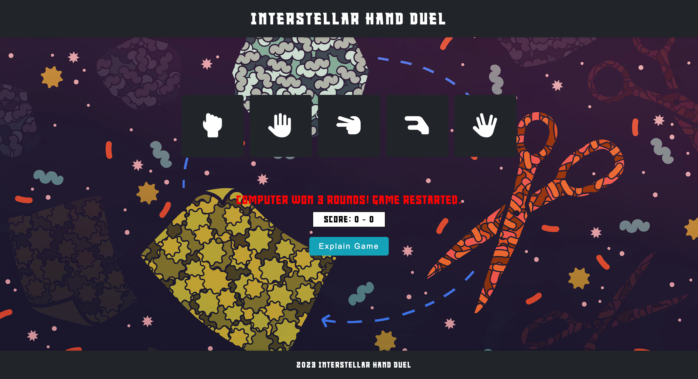
  - Challenge yourself with a set number of 3 attempts before the game concludes, adding a level of difficulty and excitement.
- **Score Tracking System:**
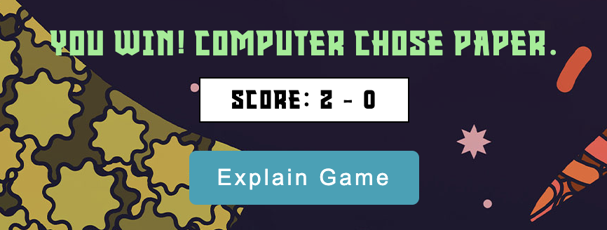
  - Keep track of your performance with a comprehensive scoring system that records wins and losses.
- **Explanation Toggle:**

  - Users can click on the "Explain Game" button to toggle the visibility of game rules and explanations.

## Technologies Utilized

The following technologies were employed in the development of this project:

- [HTML5](https://developer.mozilla.org/en-US/docs/Web/HTML): Served as the foundational markup language for the site.
- [CSS](https://developer.mozilla.org/en-US/docs/Web/css): Used to style and structure the appearance of the site.
- [JavaScript (JS)](https://www.w3schools.com/js/): Added interactivity and dynamic features to the site.
- [Balsamiq](https://balsamiq.com/): Used for creating wireframes to plan the website's structure.
- [Gitpod)](https://gitpod.io/workspaces): The primary IDE for writing and editing code during development.
- [GitHub](https://github.com/): Used to host and manage the code repository for the website & for deployment.
- [Lighthouse](https://chromewebstore.google.com/detail/lighthouse/blipmdconlkpinefehnmjammfjpmpbjk?hl=de): A Chrome extension used for performance, accessibility, and best practices audits of web applications.

## Design

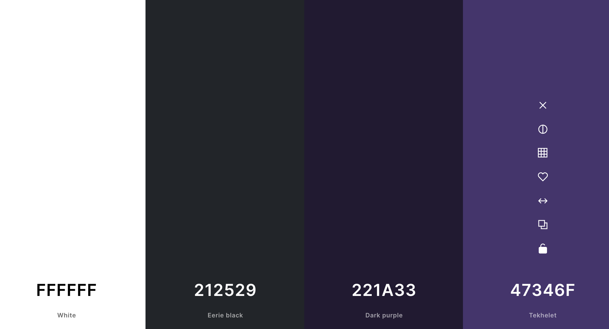
  - The color palette chosen for the game website combines deep purple, dark blueish black, charcoal black, and white. This selection aims to create a visually immersive and focused gaming experience, conveying mystery, sophistication, and clarity in the design.


## Credits
  - **Website background image source:**
  [Background Image](https://www.quantamagazine.org/biodiversity-may-thrive-through-games-of-rock-paper-scissors-20200305/)
  - **website background song tutorial:** https://www.youtube.com/watch?v=ZFqtk0Tsnsc&ab_channel=CodingBros, but was deleted later.
  ```js
  document.addEventListener("click", () =>
    document.getElementById("myAudio").play()
  );
  ```
  
- **Explanation Button Toggle:**
  - During the resolution of the explanation button bug, I referred to a tutorial for guidance. The bug was successfully fixed by implementing insights from the following resource: [Explanation Button Toggle Code Reference](https://stackoverflow.com/questions/9075440/javascript-button-show-hide-on-text-changed).

- **Favicon:**
  - Utilized a custom favicon available at [Flaticon](https://www.flaticon.com/free-icon/rock-paper-scissors_6793733).

- **Game Code Inspiration:**
  - The development of game logic and the initial code structure drew inspiration from various online resources. Additionally, the classic Rock, Paper, Scissors game served as a reference, with insights gained from the YouTube tutorial available at [BroCode](https://www.youtube.com/watch?v=n1_vHArDBRA&t=396s&ab_channel=BroCode).

- **Icons:**
  - Primary icons integrated into the project are sourced from Font Awesome.

## Bugs

I encountered two bugs during the development of the project:

1. **Background Audio Auto-Start:**
  - **Issue:** The background audio on the website used to auto-start and was loud, potentially causing a negative user experience.
  - **Solution:** The audio was removed from the code to prevent auto-start and improve user experience.

2. **Explanation Button Toggle:**
  - **Issue:** The explanation button displayed the rules, but when pressed again, it did not hide them.
  - **Solution:** The code was fixed to ensure that pressing the explanation button toggles the visibility of the rules, showing and hiding them appropriately.

  ```js
  /** Toggle the visibility of the explanation element */
  explainElement.style.display = explainElement.style.display === "none" ? "block" : "none";
  ```


## Future Features

- I'm thinking about adding an exciting feature that enables players to engage in thrilling online matches, competing against each other in real-time multiplayer games.

## Testing

**Responsiveness testing**

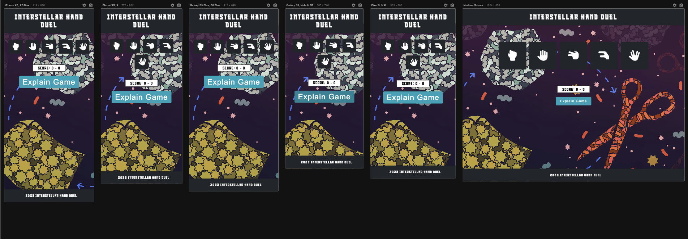
+ The website responsivity was checked with [Responsive viewer extension](https://responsiveviewer.org/).

**Lighthouse Performance testing**

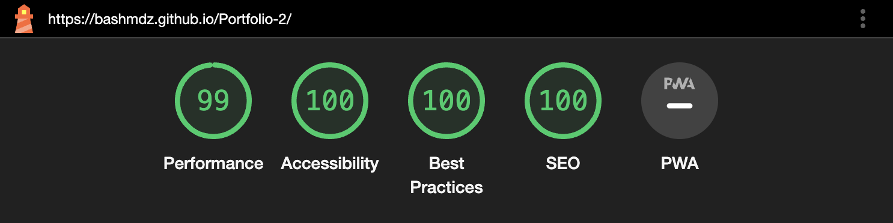
+ The website performance was checked using [Lighthouse extension](https://chromewebstore.google.com/detail/lighthouse/blipmdconlkpinefehnmjammfjpmpbjk?hl=de).

**Code Validation**

- HTML code was validated using the [W3C HTML Validator](https://validator.w3.org/).
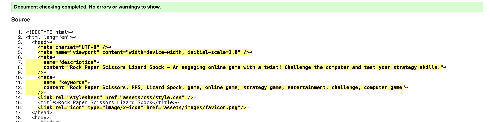

- CSS code was validated using the [W3C CSS Validator](https://jigsaw.w3.org/css-validator/).
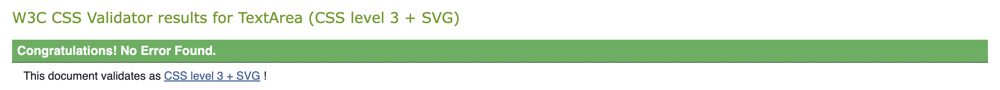

- JavaScript was validated using [JSHint](https://jshint.com/).
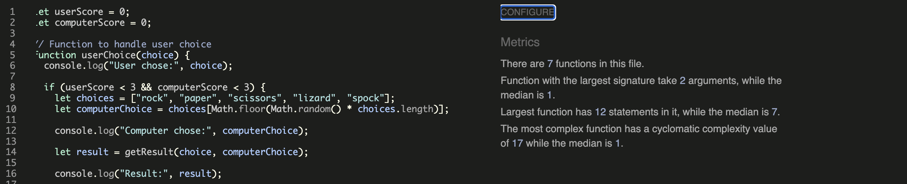


## Deployment

- The site was deployed to GitHub pages. The steps to deploy are as follows: 
  - In the [GitHub repository](https://github.com/Bashmdz/Portfolio-2.git), navigate to the Settings tab 
  - From the source section drop-down menu, select the **Main** Branch, then click "Save".
  - The page will be automatically refreshed with a detailed ribbon display to indicate the successful deployment.

The live link can be found [here](https://bashmdz.github.io/Portfolio-2/)

## Acknowledgements

- I want to express my appreciation to my mentors, **@IuliiaKonovalova** and **Rory Patrick**, for their valuable assistance and guidance throughout the project. Their insights and support have significantly contributed to its success.


## Author
**@Bashmdz**