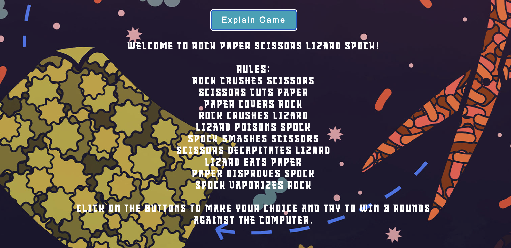

# Welcome to Interstellar Hand Duel!


Prepare for an out-of-this-world experience as you face off against the computer in our extended version of the classic Rock, Paper, Scissors game. Welcome to Interstellar Hand Duel, where the cosmic elements of Rock, Paper, Scissors, Lizard, and Spock collide in an epic battle. Take on the computer in this thrilling hand-to-hand cosmic combat across the vastness of space!

## How to Play

- You can choose from five options: Rock, Paper, Scissors, Lizard, or Spock.
- The computer will randomly make its choice.
- The winner of each round is determined by the rules:
  - Rock crushes Scissors
  - Scissors cuts Paper
  - Paper covers Rock
  - Rock crushes Lizard
  - Lizard poisons Spock
  - Spock smashes Scissors
  - Scissors decapitates Lizard
  - Lizard eats Paper
  - Paper disproves Spock
  - Spock vaporizes Rock
- The game is played in rounds, and the first to win three rounds is the overall winner.

## Features

- **Player vs. Computer:**
  - Enjoy by playing against the computer, testing your skills against an AI opponent.
- **Pattern Matching Functionality:**

  - Engage in strategic gameplay with the ability to recognize and predict patterns in the opponent's moves.
- **Limited Tries:**

  - Challenge yourself with a set number of 3 attempts before the game concludes, adding a level of difficulty and excitement.
- **Score Tracking System:**

  - Keep track of your performance with a comprehensive scoring system that records wins and losses.
- **Explanation Toggle:**

  - Users can click on the "Explain Game" button to toggle the visibility of game rules and explanations.

## Technologies Used

- HTML, CSS, and JavaScript were used to create the game.
- Responsive design using CSS Flexbox and Media Queries.
- Font Awesome icons for visual elements.

## Credits

- website background song tutorial: https://www.youtube.com/watch?v=ZFqtk0Tsnsc&ab_channel=CodingBros

```js
document.addEventListener("click", () =>
  document.getElementById("myAudio").play()
);
```

- favicon: https://www.flaticon.com/free-icon/rock-paper-scissors_6793733
- Game logic and initial code structure inspired by online resources and the classic Rock, Paper, Scissors game.
- Icons from Font Awesome.

## Bugs

-

## Future Features

- I'm thinking about adding an exciting feature that enables players to engage in thrilling online matches, competing against each other in real-time multiplayer games.

## Testing

-

## Deployment

-

## Acknowledgements

-

## Author
